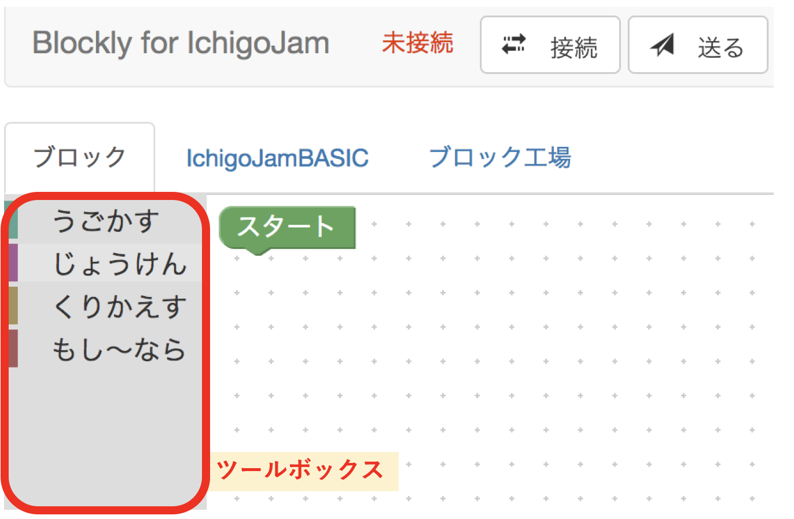
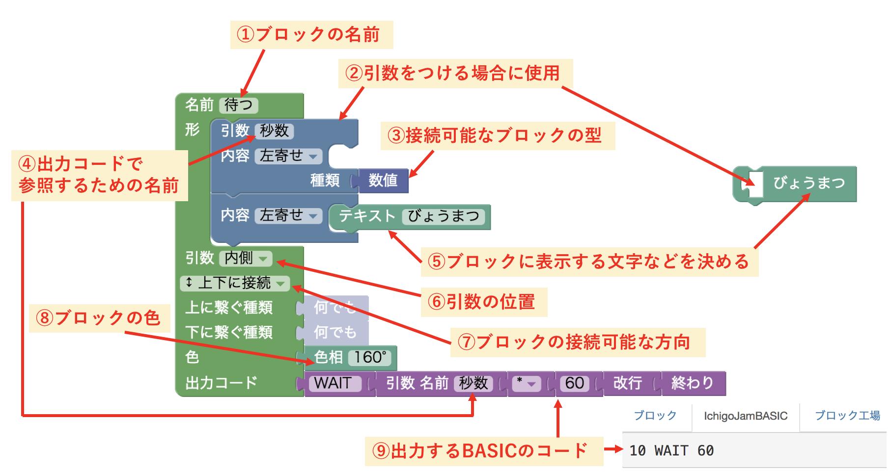
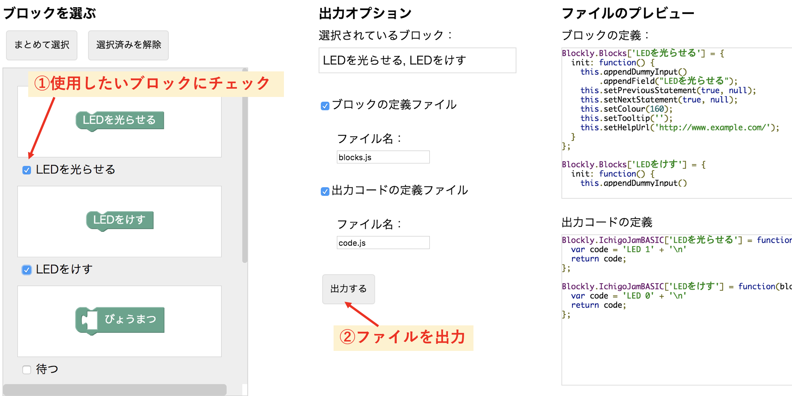
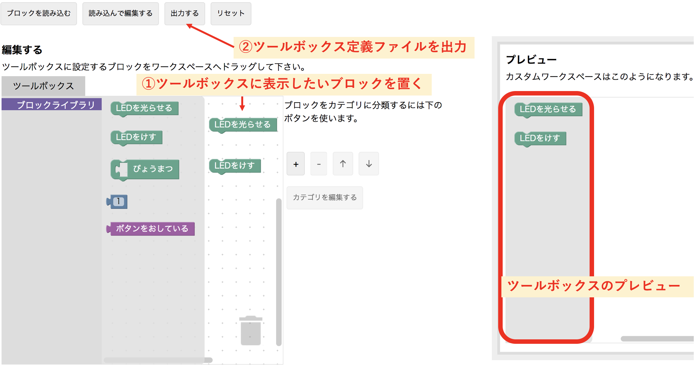
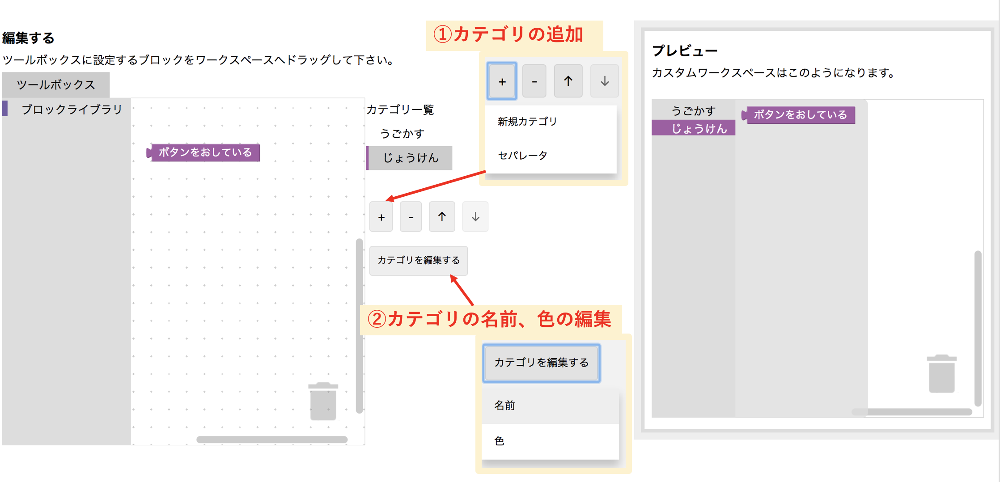

# BlocklyJam
IchigoJam用のビジュアルプログラミングツールの開発ログです。

栃木県立栃木工業高等学校にて開発されている[SkyBerryJAM](http://www.tochigi-edu.ed.jp/tochigikogyo/nc2/index.php?page_id=212)にも対応しています。

## 使い方
#### 事前準備
1. [USBシリアルモジュールのドライバ](https://www.silabs.com/products/development-tools/software/usb-to-uart-bridge-vcp-drivers)をインストールする
2. [releases](https://github.com/tg911/Blockly_IchigoJam/releases)からアプリケーションをダウンロードする

#### IchigoJamとの接続
USBシリアルモジュールは[ショップのふうせん](https://shopfusen.jimdo.com/ichigojam/usb-%E3%82%B7%E3%83%AA%E3%82%A2%E3%83%AB%E3%83%A2%E3%82%B8%E3%83%A5%E3%83%BC%E3%83%AB/)様の物でのみ動作確認しています。

1. アプリケーションの起動前にUSBシリアルモジュールをパソコンに挿しておく
2. パソコンとIchigoJamをUSBシリアルモジュールで接続する
3. macOSであれば`app/BlocklyJam.command`、Windowsであれば`app/BlocklyJam.bat`を実行する
4. 画面右上の歯車ボタンをクリックする
5. USBシリアルモジュールのポートを選択する
6. 画面上部の「接続」ボタンをクリックする（画面左上「未接続」が「接続中」に変わればOK）

#### プログラムの送信
1. ブロックを使ってプログラムが完成したら画面上部の「送る」ボタンをクリックする
2. 送信されるBASICコードは「IchigoJamBASIC」タブで確認できる

## ブロック工場
BlocklyJamでは、Blocklyのデモ（開発者）用ツールである[Block Factory](https://blockly-demo.appspot.com/static/demos/blockfactory/index.html)を改変したツールを、タブ切り替えによって使用できます。
これは、主にプログラミング教室などを実施する方が使用することを想定した機能です。
ブロック工場を使えば、プログラミング教室で実施する内容に合わせたブロックをある程度自由に作成し、カテゴリに分類することも可能です。

#### 使い方
1. 「ブロックの作成」画面で、ブロックを作成する
2. 「ブロックをファイルに出力」画面で、ブロックの定義ファイル（`blocks.js`, `code.js`）をダウンロードする
3. 「ワークスペースの編集」画面で、ツールボックスに表示するブロックを選択し、ツールボックスの定義ファイル（`toolbox.xml`）をダウンロードする
4. `blocks.js`, `code.js`を`app/js`フォルダに、`toolbox.xml`を`app`フォルダ内に入れ、それぞれ上書き保存する

反復・分岐処理用のブロックについては、code.jsが少々複雑になるため、私が作成したものをとりあえず標準で搭載しています。

#### ツールボックス
プログラミング教室などでは、実施する内容に合わせて、`toolbox.xml`を作成すると良いと思います。

</img>
<!--  -->

#### ブロックライブラリ
「ブロックの作成」画面で作成したブロックは、ブロックライブラリに保存されます。
ブロックライブラリはファイルとして保存、読み込みができるので、他人の作ったブロックを読み込むこともできます。

`app`フォルダ内に、私が作成した`ライブラリ.xml`が置いてあるので参考までに。

#### 「ブロックの作成」画面の使い方
<!-- </img> -->

#### 「ブロックをファイルに出力」画面の使い方

#### 「ワークスペースの編集」画面の使い方
**カテゴリ分け無しの場合**

**カテゴリ分け有りの場合**

## 動作確認済みOS一覧
- Windows 7 Professional (64bit)
- macOS High Sierra(10.13.1)
