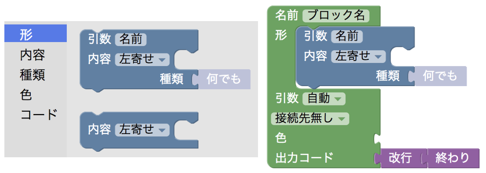
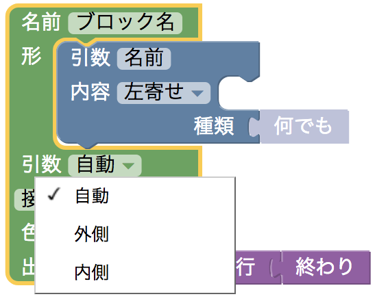
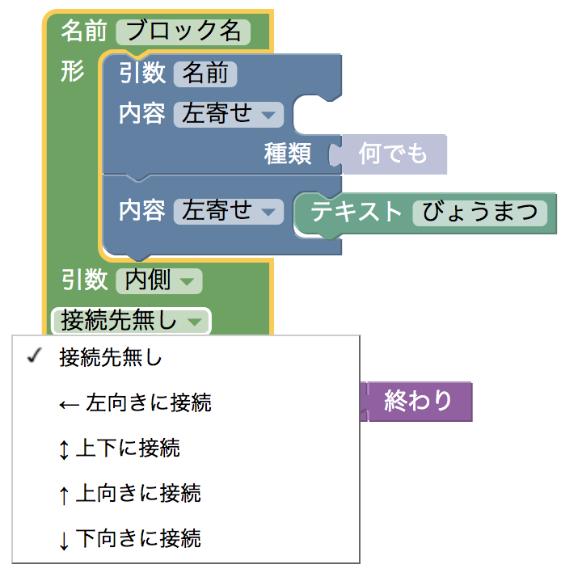
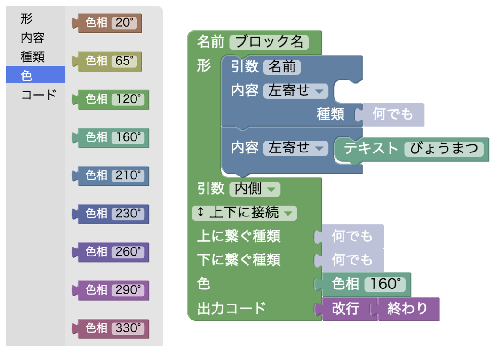
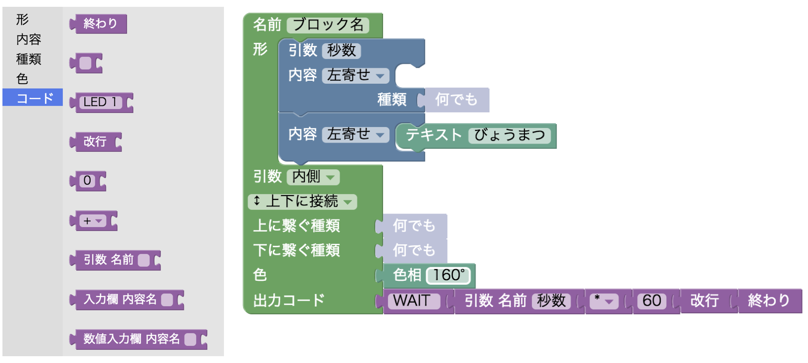
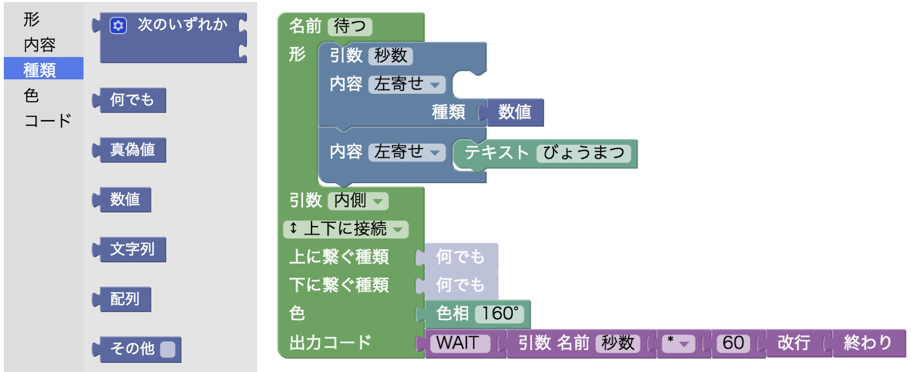

# BlocklyJam
IchigoJam用のビジュアルプログラミングツールの開発ログです。

## 使い方
#### 事前準備
1. [USBシリアルモジュールのドライバ](https://www.silabs.com/products/development-tools/software/usb-to-uart-bridge-vcp-drivers)をインストールする
2. [releases](https://github.com/tg911/Blockly_IchigoJam/releases)からアプリケーションをダウンロードする

#### IchigoJamとの接続
USBシリアルモジュールは[ショップのふうせん](https://shopfusen.jimdo.com/ichigojam/usb-%E3%82%B7%E3%83%AA%E3%82%A2%E3%83%AB%E3%83%A2%E3%82%B8%E3%83%A5%E3%83%BC%E3%83%AB/)様の物でのみ動作確認しています。

1. アプリケーションの起動前にUSBシリアルモジュールをパソコンに挿しておく
2. パソコンとIchigoJamをUSBシリアルモジュールで接続する
3. macOSであれば`app/BlocklyJam.command`、Windowsであれば`app/BlocklyJam.bat`を実行する
4. 画面右上の歯車ボタンをクリックする
5. USBシリアルモジュールのポートを選択する
6. 画面上部の「接続」ボタンをクリックする（画面左上「未接続」が「接続中」に変わればOK）

#### プログラムの送信
1. ブロックを使ってプログラムが完成したら画面上部の「送る」ボタンをクリックする
2. 送信されるBASICコードは「IchigoJamBASIC」タブで確認できる

## ブロック工場
BlocklyJamでは、Blocklyのデモ（開発者）用ツールである[Block Factory](https://blockly-demo.appspot.com/static/demos/blockfactory/index.html)を改変したツールを、タブ切り替えによって使用できます。
これは、主にプログラミング教室などを実施する方が使用することを想定した機能です。
ブロック工場を使えば、プログラミング教室で実施する内容に合わせたブロックをある程度自由に作成し、カテゴリに分類することも可能です。

#### 使い方
1. 「ブロックの作成」画面で、ブロックを作成する
2. 「ブロックをファイルに出力」画面で、ブロックの定義ファイル（`blocks.js`, `code.js`）をダウンロードする
3. 「ワークスペースの編集」画面で、ツールボックスに表示するブロックを選択し、ツールボックスの定義ファイル（`toolbox.xml`）をダウンロードする
4. `blocks.js`, `code.js`を`app/js`フォルダに、`toolbox.xml`を`app`フォルダ内に入れ、それぞれ上書き保存する

反復・分岐処理用のブロックについては、code.jsが少々複雑になるため、私が作成したものをとりあえず標準で搭載しています。

#### ツールボックス
プログラミング教室などでは、実施する内容に合わせて、`toolbox.xml`を作成すると良いと思います。

</img>
<!--  -->

#### ブロックライブラリ
「ブロックの作成」画面で作成したブロックは、ブロックライブラリに保存されます。
ブロックライブラリはファイルとして保存、読み込みができるので、他人の作ったブロックを読み込むこともできます。

`app`フォルダ内に、私が作成した`ライブラリ.xml`が置いてあるので参考までに。

#### ブロックを作る流れ
1. ブロックに引数をつけるかどうか決める。引数をつけた場合は引数となるブロックを繋げる場所が内側か外側かを決める 
</img>
</img>

2. ブロックに表示する文字、入力欄をつけるかどうかなどを決める 
</img>

3. ブロックの接続可能な方向を決める 
</img>

4. ブロックの色を決める 
</img>

5. 出力するBASICのコードを決める。引数などの値は名前を決め、コードブロックで参照する時に同じ名前を使用する 
</img>

6. ブロックの名前を決める 
</img>

7. ブロック自体、引数に接続するブロックなどに"型"を決める。例：引数には数値のブロックしかはまらないようにする 
</img>

8. 完成例 
</img>

## 動作確認済みOS一覧
- Windows 7 Professional (64bit)
- macOS High Sierra(10.13.1)
